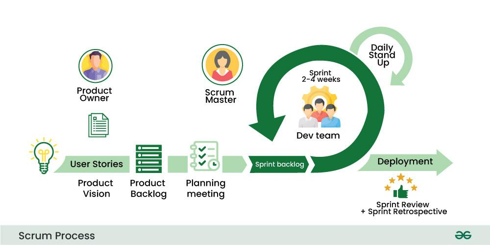

# Testing


## Unit testing -> Integration -> E2E testing
unit testing: for small pieces, testing a single unit of the application at a time


integration testing is between unit testing and e2e testing: testing multiple parts of components together

end to end testing: frontend to backend, including database, tries to emulate what a user would do with the app
acting like a real user is using the site

test runners : jest, mocha find all the test files and run them 
(by default can only test pure js code)
testing libraries: provide many utility functions
(test libraries give test runner more power, allow them to test react components and use things from the DOM)


## TDD Test Driven Development
a software development process where you write tests before writing the software code
once the tests have been written, you then write the code to ensure the tests pass
RED-GREEN testing as all tests go from a red failed state to a green passed state
1. RED
create tests that verify the functionality of a specific feature
2. GREEN
write code that will run the tests successfully when re-executed
3. REFACTOR
refactor the code for optimization while ensuring the tests continue to pass


## Test case syntax
- describe() Groups related test cases   OPTIONAL
```js
describe('Counter component', () => {
  // individual tests go here
});
```

- test() or it() Defines a single test cases
works the same just different naming style,
it() is often used for BDD-style (behavior-driven development) readability
```js
test('increments the count', () => {
  // single assertion here
});

it('decrements the count', () => {
  // same as test()
});
```
- Combined usage:
```js
describe('Counter', () => {
  test('renders with initial count', () => {
    render(<Counter initialCount={0} />);
    expect(screen.getByText('0')).toBeInTheDocument();
  });

  test('increments the count', async () => {
    const user = userEvent.setup();
    render(<Counter initialCount={0} />);
    await user.click(screen.getByText('Increment'));
    expect(screen.getByText('1')).toBeInTheDocument();
  });
});
```


## Software Development Lifecycle
Waterfall: long duration 
requirement analysis => system design => implementation(coding) => testing => deployment => maintenance
phases are dependent on each other
changes is high risk


Agile: faster time to market 
ability to create and respond to change
 


SCRUM: an agile framework used in software development to manage projects iteratively and incrementally emphasizing teamwork, collaboration, and adaptability
breaks down work into short cycles called sprints, typically lasting one to four weeks, where teams self-organize to deliver a potentially shippable product increment




# CI/ CD Continuous Integration & Continuous Deployment(DevOps key practice)
Continuous Integration: 
when developers commit code to a shared repo frequently,
each commit triggers an automated workflow on a CI server that can notify developers of any issues integrating their changes  (automatically tested and merged into the main branch)

Helps catch bugs early, avoid “it works on my machine” issues.

Example tools: GitHub Actions, GitLab CI, Jenkins, CircleCI

🔄 CI Workflow:
Dev pushes code to GitHub.
CI pipeline runs:
Linting
Unit tests
Build checks
If all passes ✅, code merges or is ready to merge.


Continuous Delivery(CD#1)
automatically build and prepare app for deployment after successful CI
ensures code is always in a deployable state


Continuous Deployment(CD#2)
takes it one step further -- automatically deploys code to production


CI/CD is a 
powerful software development practice that can help teams ship better-quality software faster
however, it's not a one-size-fits-all solution and its implementation may vary depending on the complexity of the system


# DevOps = Dev(development) + Ops (Operations)
CI/CD is a part of DevOps, but not all of it.

Goal: 
